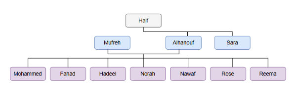

# Family Tree in Prolog


## Description

This lab represents a family tree using Prolog.

It shows the relationships between family members and allows me to query information about parents, brothers, sisters, and other family connections.

## Family Members

Haif is the main parent in the family tree.

Haif has two children:

- Alhanouf
- Sara
  
Mufreh has the following children:
- Mohammed
- Fahad
- Hadeel
- Norah
- Nawaf
- Rose
- Reema

## Relationships

The lab represents the following relationships:

- Male family members
- Female family members
- Parent relationships
- Father
- Mother
- Brother
- Sister


## The queries


1. Open the Prolog file in SWI-Prolog.
2. Load the program.
3. Use the following command to consult the file:

```prolog
?- consult('myprogram.pl').

### 1. Who is the father of Sara?

```prolog
?- father(X, sara).
X = haif.
